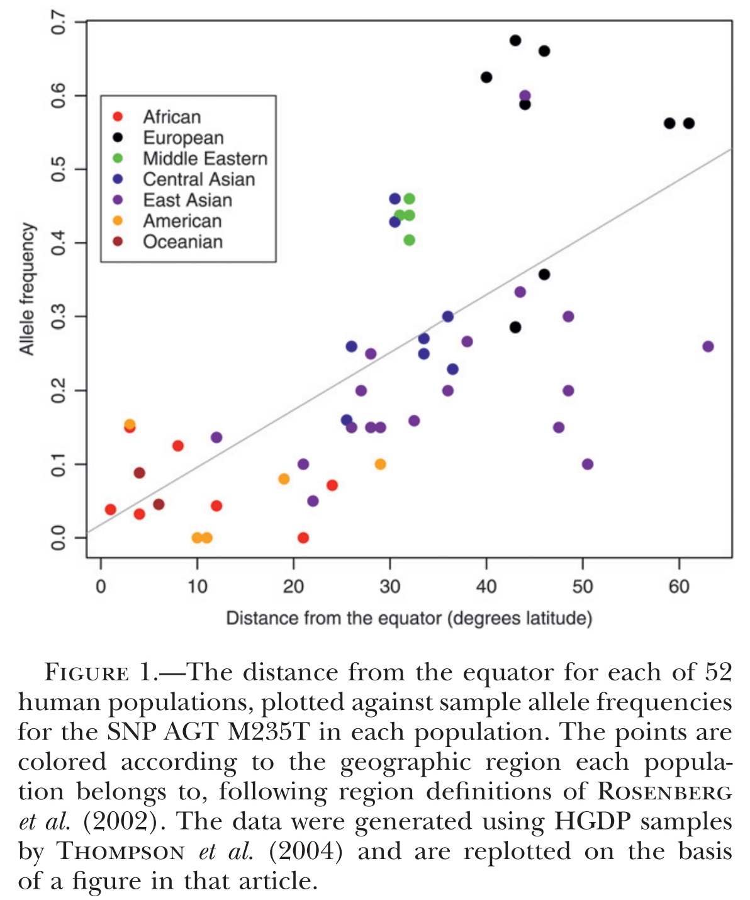

### 基因组上一个与环境相关的位点，有什么样的特征？
* 这些位点可能表现出等位基因频率与重要生态变量之间有异常的相关性或者不同地理环境间的等位基因频率的差异很大，这些特征可以使我们识别出参与局部适应的潜在位点。
### 如果想在全基因组上鉴定一个环境相关的位点，会遇到什么样的困难？
* 样本大小的差异，群体之间共享的分化历史和基因流可能会导致群体间的等位基因频率有一定的相关性(neutral correlation)，这会混淆我们对适应性位点的鉴定。
### 如何克服？
* 作者开发了一种贝叶斯方法，从一组标记中估计群体间等位基因频率协方差的经验模式，然后将其作为一个零模型用于单个SNPs的测试。
### 方法具体是怎样的？
* 在作者的模型中，群体中一个等位基因的频率来自一组潜在的群体频率，假设这些总体频率的变换遵循多元正态分布。
* 作者首先用蒙特卡罗马尔可夫链估计多元正态分布的协方差矩阵。在每个SNP中，作者提供了一种支持模型的度量方式-贝叶斯因子，其中环境变量对转换后的等位基因频率有线性影响，而不是单独由协方差矩阵给出的模型。该测试的性能优于现有的相关测试。
* 作者还证明，该方法可以用于识别具有异常大的等位基因频率分化的snp，并提供了一个强有力的基于两两或全局FST的替代方法。
* 软件 http://www.eve.ucdavis.edu/gmcoop/

### 问题描述
* 如图1所示，在广泛区域内的群体在等位基因频率和离赤道的距离（纬度）两个变量上都是聚集的。因此，等位基因频率和环境变量之间的相关性仅得到了比图1中52个点少得多的独立观察数据的支持。此外，还不清楚图1中等位基因频率的变化是否是由于样本量少造成的采样误差或者遗传漂变产生的。
* 因此，在作者的模型中，在测试环境变量和等位基因频率之间的相关性时，考虑了样本大小的差异和等位基因频率的零相关假设。
* 为了做到这一点，我们使用一组控制位点（control loci）来构建等位基因频率如何在人群中共变的零模型（null model）。然后，我们可以测试在一个感兴趣的位点看到的等位基因频率与环境变量之间的相关性是否大于这个零模型的预期。我们集中讨论了snp等共显性和双等位的标记，该模型也可以扩展到其他类型的标记。本文提出的方法可应用于连续或离散环境变量。
### 方法
零模型(Null model):
假设在K个群体中有L个独立的SNPs。如果L非常大，为了提高计算速度，我们可以使用L的一个大的随机子集来估计空模型。与环境相关的标记可能在L中，但是我们预计这一小部分的位点对零模型的参数估计产生很小的影响。另外，L也代表了一组良好的控制标记。

To overcome the constrained nature of allele frequencies
为了克服等位基因频率的局限性：
我们遵循尼科尔森的假设：亚群的等位基因频率通常是正态分布的，围绕着一个祖先的等位基因频率el (0<el<1)，频率高于1和低于0的替换为1和0。

此外，我们采用nicholson等人(2002)的假设，对于一个特定的子种群，这个正态分布的方差是一个因子的乘积，该因子在各个位点上都是常数，再乘以一个特定的位点项。

该模型描述了一个纯漂移模型，在该模型中，每个种群中的等位基因频率独立地从祖先等位基因频率漂移。
